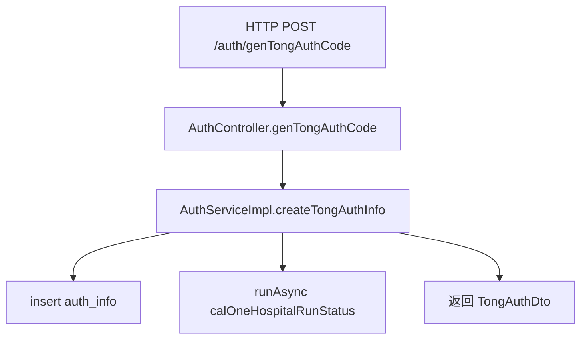

# 示例：与 `SKILL.md` 输出结构对齐的写法

> 本文件演示 **`SKILL.md` 当前「输出结构」**（1 入口与入参 → 2 出参与变更与依赖 → 3 流程 → 4 实体清单与关系 → 5 用例 → **6 横切收尾**）的**章节标题、表格用法与图文配合方式**。  
> 实际分析须以仓库代码为准；**完整、可落地的长文范例**见仓库内落盘稿（与技能一次完整执行结果同级）：
>
> - [`ai_docs/26041301-genTongAuthCode-AuthController入口解读.md`](../../../ai_docs/26041301-genTongAuthCode-AuthController入口解读.md) — **HTTP 接口**（`AuthController.genTongAuthCode`）
> - [`ai_docs/26041302-calOneHospitalRunStatus-QualityControlManager入口解读.md`](../../../ai_docs/26041302-calOneHospitalRunStatus-QualityControlManager入口解读.md) — **非 HTTP 业务入口**（`QualityControlManager.calOneHospitalRunStatus`）

下文为**压缩版示范**：保留六章骨架与关键写法；流程图规则（何时画、父子流程、Mermaid 边标签写法等）以 `SKILL.md` **§3.3** 为准；实体小节细则以 **§4** 表格为准。

---

## 示例一：`POST /auth/genTongAuthCode`（`AuthController.genTongAuthCode`）

### 1. 入口与入参解析

- **入口**：Spring MVC **HTTP POST**，后台「认证 / 授权码」能力，生成通平台院端授权码并落库。
- **进入条件**：URI 匹配 `POST /auth/genTongAuthCode`（类 `@RequestMapping("/auth")` + 方法 path）；`AuthSetFilter` 非白名单需登录头；`@ValidLoginUser` 注入 `AdminUserInfo`；`@PreAuthorize` 按 `app` 分支要求 `activation_code:*`；`@Valid` 校验 Body。
- **入参形态**：JSON → `@RequestBody TongAuthReq`；登录用户由解析器注入（`@ApiIgnore`）。
- **参数逻辑（影响分支/权限/算法）**：`app`（权限 SpEL + 枚举盐）；`deviceCode`（摘要与异步键）；`recordId`、`version` 等落库与校验字段。

**（Java）接口锚定（表或列表均可）**

| 项 | 内容 |
|----|------|
| HTTP | `POST`，完整路径（代码级）`/auth/genTongAuthCode` |
| 文档名 | `@ApiOperation("获取通平台院端授权码")` |
| 权限 | `@PreAuthorize` 按 `app`；`@ValidLoginUser` + 过滤器登录链 |
| 绑定与返回 | `@RequestBody TongAuthReq`；返回 **`TongAuthDto`**（与同 Controller 其它方法包装方式可能不同，需对照代码） |

---

### 2. 出参、数据变更与外部依赖

| 内容 | 说明 |
|------|------|
| **出参** | `TongAuthDto`：`authCode`、`validInfo`（有效期文案等）。 |
| **存储变更** | **写**：`auth_info` 插入一条（字段含 `source="tong"`、医院/设备/授权人等）。 |
| **外部依赖** | 无直连第三方 HTTP/RPC；异步内 `QualityControlManager.calOneHospitalRunStatus` 对多表**可能写**，标 **可能写型（异步）**。 |
| **其它副作用** | 日志；`CompletableFuture.runAsync` 触发质控重算，与响应线程解耦。 |

---

### 3. 流程

#### 3.1 核心流程概括

用 **3～8 句**写清：鉴权与校验 → 服务层按 `app` 与设备码生成授权码 → 组装实体写 `auth_info` → 异步按设备码触发质控 → **同步**返回 DTO（不写 MD5 细节，细节放 3.2 / 图）。

#### 3.2 纵向链路（入口 → 边界）

1. `AuthController.genTongAuthCode` → `authService.createTongAuthInfo`  
2. `AuthServiceImpl.createTongAuthInfo`：`TongAppEnum` → `KeyGenUtil.getTongDigestValue` → 拼 `authCode` → 建 `AuthInfo` → `authInfoMapper.insert` → `asyncCalcHospitalRunStatus`  
3. 异步：`qualityControlManager.calOneHospitalRunStatus(deviceCode)`（下钻见示例二或完整 `ai_docs/26041302-...`）

#### 3.3 流程图 / 时序图（示意）

- 复杂主路径须**总览 + 子图**；下图仅为**总览节点数**示意，边标签写法遵守 `SKILL.md` **3.3**（`A -->|标签| B`）。

---

### 4. 实体清单与关系

- **关键实体清单**：表 `auth_info`（写）；DTO `TongAuthReq` / `TongAuthDto`；实体 `AuthInfo`；枚举 `TongAppEnum`；`AdminUserInfo`。  
- **关系与约束**：请求与用户字段映射到 `auth_info`；异步链路与 `hospital_run_detail` 等业务表的关系见 **`26041302`** 或继续下钻 Mapper。  
- **关系图**：`erDiagram` 或依赖简图；**图中每实体约 ≤3 个字段**，其余放「字段说明」。  
- **数据转换链**：`TongAuthReq` + `loginUser` + 摘要结果 → `AuthInfo` → `insert`；业务字段 → `TongAuthDto`。

---

### 5. 用例

至少一条：**入参示例（可 JSON）** → **内部关键步骤（与 §2、§3.2 呼应）** → **出参示例**。敏感数据脱敏并标注「示例」。完整数字与字段表见 **`26041301-...`**。

---

### 6. 横切与其它（收尾；最后写）

| 类别 | 示例写法 |
|------|----------|
| 安全 | 过滤器 + `@PreAuthorize` + 登录解析 |
| 事务/异步 | 主线程插入与异步质控非同一事务；失败是否监控 → **待确认** |
| 幂等 | 每次 `insert`，非幂等 → 写明 |

---

## 示例二：`QualityControlManager.calOneHospitalRunStatus(String deviceCode)`

> **非 HTTP 入口**：无 Controller 路径锚定；§1 中写明「本入口不涉及」HTTP 锚定，并说明典型调用方（如 `AuthServiceImpl` 异步、`LogServiceImpl` 同步等，以代码检索为准）。

### 1. 入口与入参解析

- **入口**：Spring `@Component` 的 **Manager 方法**，职责：设备码维度 **核对授权信息**（`cleanAuthInfo`）→ 取医院编码列表 → **从固定历史季度到当前默认季度** 重算运行明细。  
- **进入条件**：`deviceCode` 非空白；否则 `warn` 返回。  
- **入参形态**：单一 `String`。  
- **参数逻辑**：`deviceCode` 驱动 `CleanAuthInfoReq.deviceCodes`、SQL `in`、医院列表 `eq` 查询。  
- **Java 接口锚定**：**本入口不涉及** `@GetMapping` 等；可一句说明与 `QualityControlController.calHospitalRunStatusAll` 等 HTTP 能力的**复用关系**。

---

### 2. 出参、数据变更与外部依赖

| 内容 | 说明 |
|------|------|
| **出参** | `void`；可观测结果为下层写库与日志。 |
| **存储变更** | **读**：`auth_info`、`hospital_info`、`submit_record` 等；**写**：`auth_info_check`、`device_code_check`、`hospital_run_detail`（先删后插等，以 `HospitalRunDetailServiceImpl` 为准）。 |
| **外部依赖** | 本应用内 Service/Mapper 为主；`staffInfoService.hospitalList` 等偏**读型**，结果驱动写明细。 |
| **其它副作用** | 日志；`calHospitalRunStatusAll` 内对请求对象的克隆不改变调用方引用。 |

---

### 3. 流程

#### 3.1 核心流程概括

3～8 句：校验设备码 → `cleanAuthInfo` 全链路核对与回写 → 取医院编码列表 → 空则告警返回 → 非空调 `calHospitalRunStatusAll` 从 **2024Q3** 游标到目标年季 → 每步 `calHospitalRunStatus` 写 `hospital_run_detail`（概括句不写 SQL 细节）。

#### 3.2 纵向链路

按 **`26041302-...`** 中 1～10 步的粒度展开：`calOneHospitalRunStatus` → `cleanAuthInfo` → `doInitAuthInfoChecks` / `doProcessDeviceCheck` / `doAuthInfoCorrectCal` → `getHospitalCodeListByDeviceCode` → `calHospitalRunStatusAll` → `self.calHospitalRunStatus` → … → `HospitalRunDetailServiceImpl.calHospitalRunStatus`。

#### 3.3 流程图 / 时序图

- **总览** + **子流程 A（cleanAuthInfo）** + **子流程 B（季度游标）** + **时序图（多参与者）** 四件套写法，直接对照 **`26041302-...`**；此处从略。

---

### 4. 实体清单与关系

- 表：`auth_info`、`auth_info_check`、`device_code_check`、`hospital_run_detail`、`hospital_info`、`submit_record` 等；每行注明 **读/写** 与在本入口中的用途。  
- **ER / 依赖图** + **数据转换链**（`CleanAuthInfoReq.isValid=2` 的 SQL 语义、`CalHospitalRunStatusReq.calType=0` 等）见完整稿。

---

### 5. 用例

- **入参**：`deviceCode = "DEV-HOSP-001"`（示例）。  
- **内部**：`cleanAuthInfo` 更新核对表与设备表 → 得到 `["H001"]` → 多季度循环写 `hospital_run_detail`。  
- **出参**：`void`；说明库表上可核对的变化。

---

### 6. 横切与其它（收尾）

- **事务**：`@Transactional` 与 `self` 代理调用导致的长事务风险、超时与隔离级别 → **待确认**。  
- **并发**：异步线程无 Web 上下文、同设备并行竞态 → **待确认**。  
- **注释与实现**：若注释写「清理」实际未 `delete auth_info`，须在文档中点明，避免读者误解。

---

## 与 `SKILL.md` 的对应关系（写 examples 时自检）

| `SKILL.md` 章节 | 本文件示范位置 |
|-----------------|----------------|
| §1 入口与入参 | 两示例的「进入条件 / 形态 / 参数逻辑 /（可选）Java 锚定」 |
| §2 出参与变更 | 两示例的表格：出参、存储读/写、外部依赖读/写判定 |
| §3 流程 | 3.1 概括与 3.2 链路分离；3.3 配图规则与 Mermaid 兼容 |
| §4 实体 | 清单 + 关系 + 图（≤3 字段）+ 转换链 + 字段说明 |
| §5 用例 | 入参 → 内部 → 出参（含 `void` 的可观测结果） |
| §6 横切 | **全文最后**；有则写、无则省略；**待确认**集中亦可放 §6 |

按任务需要，可直接**复制**上文某一示例的标题层级到 `ai_docs/YYMMDDNN-描述.md`，再按代码把表格与 Mermaid **填满**；长链路、多图、长事务与待确认清单以两篇 **`26041301` / `26041302`** 为黄金参考。
