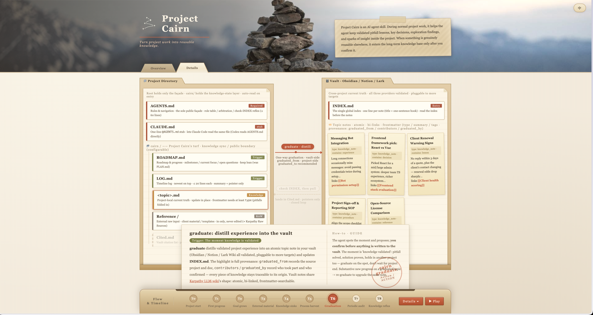
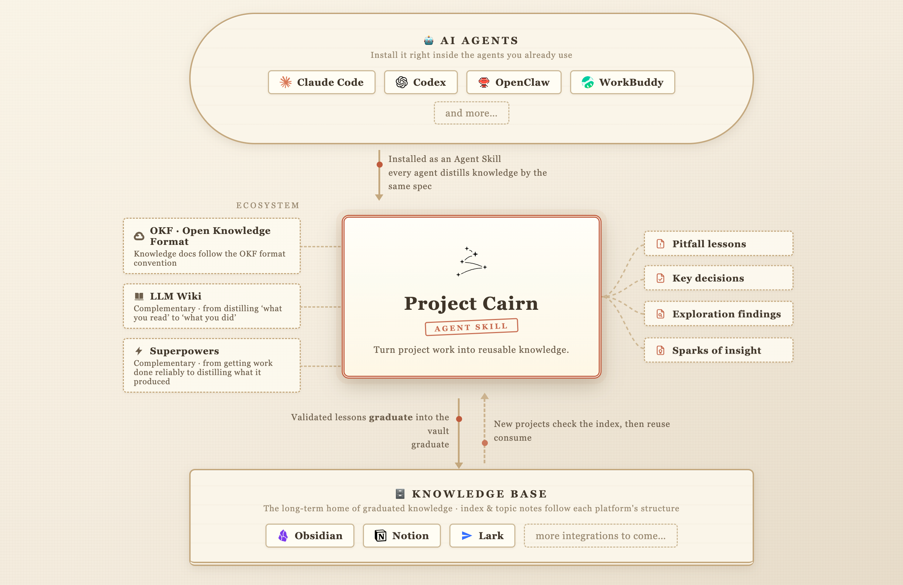

# Project Cairn

**把项目工作沉淀为可复用知识。**

[打开交互式指南，了解本 Skill](https://iblinkq.github.io/project-cairn/)

[](https://iblinkq.github.io/project-cairn/)

## 是否似曾相识？

- 同一个问题，在下一个项目里又回来了。
- 新开会话或换一个 agent，上下文和规则又要从头讲一遍。
- 计划、进展和结论散落各处，agent 在新旧方向之间来回跳。
- 你知道答案存在，只是埋在某次旧对话里。

## Project Cairn 做什么

Project Cairn 是一个 agent skill。在正常的项目工作中，它帮助 agent 把已验证的踩坑教训、关键决策、探索发现和灵感火花留在项目内。当某条经验确实可在别处复用时，agent 可在你确认后，把它准备进长期知识库。



各文件职责分明：

- `AGENTS.md` 保存 agent 每次进入项目都会读取的规则。
- `cairn/LOG.md` 记录发生了什么，用短摘要和指针。
- `cairn/ROADMAP.md` 保持总目标、计划与当前进度。
- `cairn/<topic>.md` 保存某一主题的当前结论。
- `cairn/Cited.md` 指向真正影响了本项目的外部知识，不复制正文。

cairn（石堆路标）是先前旅人堆起的路标。这个名字点出目标：让下一个项目看得见上一个项目找到的安全路线。

## 适合谁

当你同时推进多个 AI 协作项目、在 Claude Code 与 Codex 等兼容 skill 的 agent 之间切换，或需要项目知识活过单个人的记忆时，Project Cairn 很有用。

## 安装

**Claude Code**，用户级安装：

```bash
git clone https://github.com/iBlinkQ/project-cairn.git ~/.claude/skills/project-cairn
```

**Codex**，用户级直接 skill 路径：

```bash
git clone https://github.com/iBlinkQ/project-cairn.git ~/.agents/skills/project-cairn
```

**WorkBuddy**，导入本地 skill 包：

1. 下载 [Project Cairn ZIP](https://github.com/iBlinkQ/project-cairn/archive/refs/heads/main.zip)。
2. 从 WorkBuddy 侧边栏打开 Skills。选择 Add Skill，再选 Upload Skill。
3. 选择下载的 ZIP。WorkBuddy 会自动配置，无需手动拷进某个目录。

安装界面见 [WorkBuddy 官方 skill 指南](https://www.workbuddy.ai/docs/workbuddy/From-Beginner-to-Expert-Guide/Function-Description/Skills-Market)。

对其他兼容 skill 的 agent，把仓库克隆到该 agent 加载 skills 的目录。`SKILL.md` 必须直接位于 `project-cairn/` 根目录，不要再套一层文件夹。

前置依赖：`git`，以及 `scripts/*.sh` 所需的 `bash`。Shell 脚本已在 macOS 与 Linux 验证；Windows 用户需要 WSL 或 Git Bash。Python 脚本需要 Python 3；`notion-graduate-batch.py` 还需要 PyYAML。目前尚无包管理器发行版。

若从本仓库（gd26-skills）使用：把本目录同步到 agent 的 skills 路径即可，同样要求 `SKILL.md` 位于 skill 根目录。

## 三步开始

1. 让 agent「在本项目中初始化 Project Cairn」。它会收集项目摘要、git 策略与迁移选择，然后创建规则与配置。对接知识库 provider 可推迟到第一次毕业。
2. 照常工作。在普通协作回合中，agent 按 `AGENTS.md` 维护进度与当前结论。没有单独的「记录服务」要跑。
3. 当一条已验证的教训可能帮到其他项目时，让 agent 准备毕业候选。在你确认范围之前，不会写入长期知识库。后续项目先搜索；只有结果真正影响了工作时，才在 `cairn/Cited.md` 追加指针。

## 两侧分工

Project Cairn 分开两条生命周期，而不是把所有信息塞进一份越长越大的文件。

| 侧 | 保留什么 | 典型位置 | 何时阅读 |
|---|---|---|---|
| **项目侧** | 规则、进度、当前结论与本地案例 | 根目录 `AGENTS.md` 与 `cairn/` | 进入与推进项目时 |
| **知识库侧** | 可跨项目复用的蒸馏知识 | Obsidian、Notion 或飞书 / Lark wiki | 新工作需要更早的教训时 |

项目侧让本地事实与结论保持新鲜。当一条教训证明超出本项目仍有用时，经人工确认的毕业把它蒸馏进知识库侧。每一侧在各自范围内保持权威。

## 一条教训如何到达下一个项目

以消息机器人问题为例：

1. 初始化把 Cairn 规则与配置写入项目。
2. agent 调查过程中，有实质进展的事项记入 `LOG.md`。
3. 原因与修复验证后，当前结论进入知识专题文档。
4. 来自规格、计划、评审或复盘的稳定结论也可蒸馏。过程产物仍留在原处。
5. agent 发现该教训可能可复用，提出毕业候选。
6. 你批准后，agent 去掉项目特有噪声、补充背景与边界、记录出处、写入笔记并更新 provider 索引。
7. 后续项目在再次解题前先搜知识库。若某条笔记塑造了工作，`Cited.md` 记指针而非副本。

交互式总览把这段旅程展开为 T0 到 T8，含路线图维护、审计与再毕业：[浏览完整流程](https://iblinkq.github.io/project-cairn/)。

## 它保留什么

Project Cairn 不会一次打出一堆空模板目录。除核心初始化文件外，文档只在出现真实信号时才创建。

| 文件 | 职责 |
|---|---|
| `AGENTS.md` | 规则与导航 |
| `.cairn/config.yaml` | 机器可读配置 |
| `cairn/LOG.md` | 倒序时间线 |
| `cairn/ROADMAP.md` | 总目标、计划与当前进度 |
| `cairn/<topic>.md` | 某一主题的当前真相 |
| `cairn/Reference/` | 项目拥有的外部原始材料 |
| `cairn/Cited.md` | 影响了工作的知识指针 |

被代码直接消费的 schema、配置与契约留在代码树。Cairn 保留它们周围的知识：为何是这样、试过哪些替代、实现时出过什么错。

知识专题文档使用 Markdown 与 YAML frontmatter，至少含 `type` 字段，遵循 Google [Open Knowledge Format](https://cloud.google.com/blog/products/data-analytics/how-the-open-knowledge-format-can-improve-data-sharing) 的最小约定。Project Cairn 并不声称实现完整 OKF bundle。

已毕业笔记通过 `graduated_from`、`contributors`、`graduated_by`、`authoring_mode` 携带出处，便于追溯到产生该结论的人、项目与源材料。

## 自动化边界

- Project Cairn 没有后台 hook，也不会在聊天结束后自动运行。
- 日常维护在正常工作中发生，因为项目的 `AGENTS.md` 承担规则。
- agent 可以建议毕业候选，但未经人工确认不能写入长期知识库。
- 对接 Obsidian、Notion 或飞书 / Lark 可推迟到第一次毕业。
- 审计报告矛盾、过时结论与遗漏；不会静默改写重要决策。

毕业从项目侧写到知识库侧。复用方式是先搜索，真正用到某条笔记时再在 `Cited.md` 留指针。这是显式消费，不是两套存储之间的后台同步。

## 已验证的知识库

Project Cairn 已验证以下毕业路径：

- **Obsidian**：vault 相对路径文件、`INDEX.md` 与原生 WikiLinks。
- **Notion**：数据库同时作为容器与索引，结构化元数据映射到 properties。
- **飞书 / Lark wiki**：知识空间树中的节点，以及可回读的链接。

每个 provider 遵循 `references/provider-interface.md` 中的行为契约，同时保留其平台原生的链接与索引模型。provider 特定执行路径在 `references/graduation/`。任何写入之前，可用对应的只读 preflight 检查安装、鉴权与访问：

```text
scripts/obsidian-preflight.sh
scripts/notion-preflight.sh
scripts/lark-preflight.sh
```

## 了解更多

Project Cairn 补足相邻工具，而不是取代它们：

| 工具或方法 | 主要工作 | 与 Cairn 的关系 |
|---|---|---|
| [LLM Wiki](https://github.com/karpathy) | 把读过的源材料组织成 wiki | LLM Wiki 侧重源知识；Cairn 侧重通过项目工作学到的知识 |
| [Open Knowledge Format](https://cloud.google.com/blog/products/data-analytics/how-the-open-knowledge-format-can-improve-data-sharing) | 让知识文件可被人与机器交换 | OKF 关心格式；Cairn 关心形成、维护、毕业与复用 |
| Agent memory | 保留 agent 的偏好与工作上下文 | Memory 支持 agent 连续性；Cairn 支持项目知识连续性 |
| [superpowers](https://github.com/obra/superpowers) | 通过规格、计划、测试与评审提高交付可靠性 | superpowers 管过程；Cairn 保留从中学到的稳定结论 |

agent「记得某件事」不等于项目「学会了某件事」。

## 文档地图

| 参考 | 用途 |
|---|---|
| `references/init.md` | 初始化或改造 Project Cairn |
| `references/maintenance.md` | 维护 `LOG.md`、`ROADMAP.md` 与知识专题文档 |
| `references/graduation.md` | 判断、蒸馏并写入可复用知识 |
| `references/graduation/` | 每个 provider 一条执行路径（飞书 wiki、Notion、Obsidian） |
| `references/provider-interface.md` | provider 适配器的行为契约 |
| `references/consume.md` | 搜索、使用并引用外部知识 |
| `references/audit.md` | 发现漂移、矛盾与缺漏记录 |
| `references/upgrade.md` | 检查并升级已初始化项目 |
| `references/frontmatter.md` | 项目笔记与知识库笔记字段 |
| `references/branch-closure.md` | 在探索分支关闭前抢救知识 |
| `references/zh-glossary.md` | 中文项目文档的固定术语 |

## 贡献

欢迎 Issues 与 Pull Requests。Project Cairn 以文档为先，多数贡献落在 `SKILL.md`、`references/*.md`、`assets/templates/*` 或 `scripts/`。若变更影响行为，请在 PR 中说明原因与影响。

## 许可

[MIT](LICENSE)
